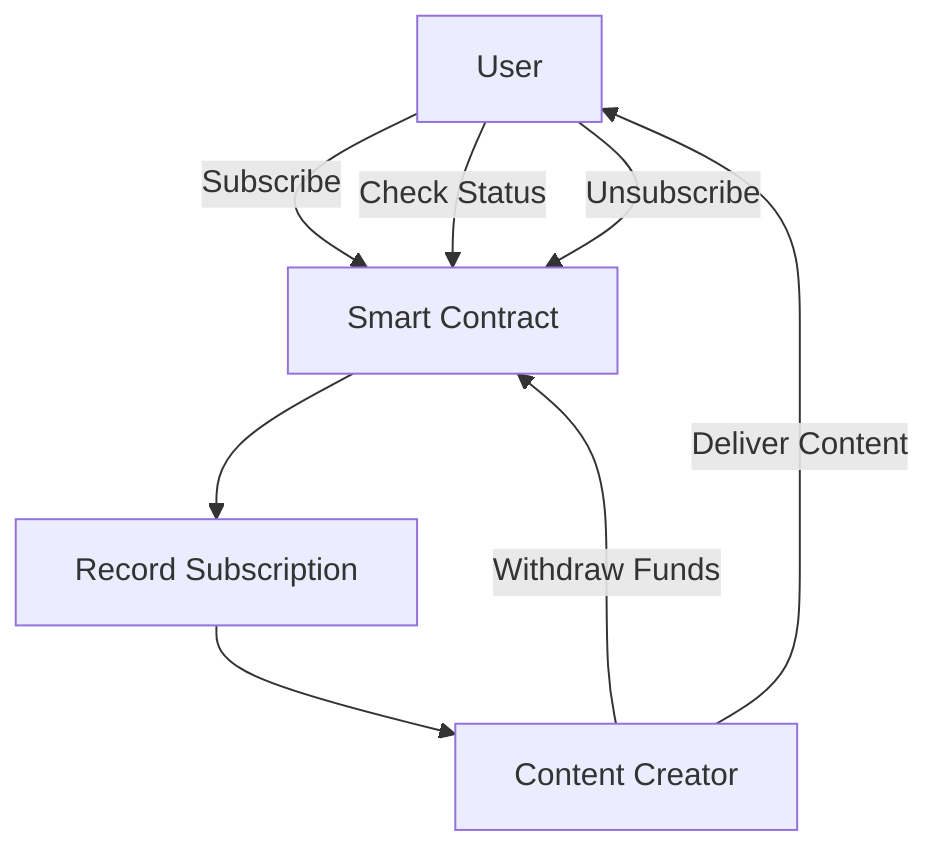

Here's a `README.md` file tailored for the provided smart contract:

---

# Decentralized Subscription Smart Contract

## Vision

Our mission is to revolutionize content monetization by providing content creators with a decentralized, transparent, and secure platform for managing subscriptions. This smart contract enables creators to directly engage with their audience without intermediaries, ensuring that payments are transparent and secure.

## Flowchart



## Smart Contract Address

**Contract Address:** `0xYourContractAddressHere`  
*(Replace with your actual deployed contract address)*

## Features

- **Direct Subscriptions:** Users can subscribe by sending Ether directly to the smart contract.
- **Transparent Transactions:** All subscription details and payments are recorded on the blockchain.
- **Subscription Status:** Users can check their subscription status anytime.
- **Unsubscribe Option:** Users have the freedom to unsubscribe when they choose.
- **Creator Control:** Content creators have full control over withdrawing the funds accumulated in the contract.

## Installation & Deployment

1. **Clone the Repository:**
    ```bash
    git clone https://github.com/your-repo/decentralized-subscription.git
    cd decentralized-subscription
    ```

2. **Compile and Deploy:**
   - Use Remix, Hardhat, or Truffle to compile and deploy the contract.
   - Deploy the contract on an Ethereum network (Mainnet, Ropsten, etc.).
   - Copy the deployed contract address for interaction.

3. **Interact with the Contract:**
   - Users can interact with the contract using tools like Remix, Etherscan, or through a custom dApp frontend.

## Future Scope

- **Recurring Payments:** Introduce automated recurring payments for continuous access to content.
- **Multiple Tiers:** Develop tiered subscription models with varying levels of access and pricing.
- **Token Payments:** Enable payments using ERC-20 tokens to broaden payment options.
- **Platform Integration:** Integrate the contract with various content platforms to streamline the subscription process.

## Contact Information

For inquiries, suggestions, or support, please reach out:

**Name:** Diya Das
**Email:** diyad2712@gmail.com
**GitHub:** https://github.com/diy-ux/smart_ott


---

**Note:** Replace placeholders with your actual contract address and contact details before using this `README.md` file.
